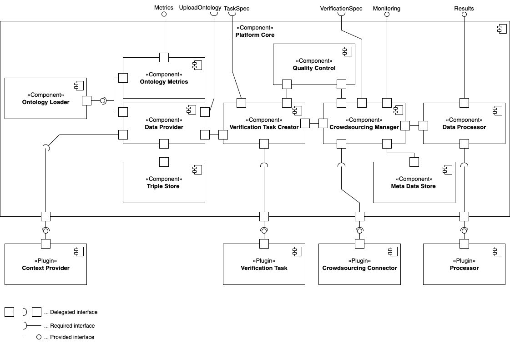

# hc-ov-core: A end-to-end process support platform for human-centred ontology verificaiton

This repository provides the implementation of `hc-ov-core` an extenisble platform that supports ontology engineers in creating human-centred ontology
verification on crowdsourcing platforms such as [Amazon Mechanical Turk](https://www.mturk.com/).

The main features of the platform include:

* Providing tool-support for conducting human-centred ontology verification.
* Orchestration of the whole human-centred ontology verification process from prepartion to result processing.
* Storing ontologies, extracted sub-ontologies and meta-data about verification in a centralised way.
* Extensions for new types of verifications, crowdsourcing platforms, context providers and processing methodologies through plugins.

## Architecture

An overview of the platform implementation is best provided by considering following component diagram:

The components implemented with this repository include all components in the component `Platform Core` and it's interfaces.
Further, a default `IProcessorPlugin` plugin `RawDataProcessorPlugin` is implemented that allows to expose unprocessed raw results from a crowdsourcing
platform.
Also note that the component `Ontology Metrics` is not yet implemented.

All implemented external interfaces (e.g. `UploadOntology` or `TaskSpec`) following the REST over HTTP paradigm.
An OpenAPI 3.0 specification can be found
in [`src/main/resources/openapi.yaml`](https://github.com/k-klemens/hc-ov-core/blob/master/src/main/resources/openapi.yaml)
and a Swagger page is hosted under the path `/swagger-ui/index.html`.
For an exemplary workflow and interaction with the platform the postman
collection [HCOV-CORE PIZZA.postman_collection.json](https://github.com/k-klemens/hc-ov-core/blob/master/src/main/resources/HCOV-CORE%20PIZZA.postman_collection.json)
can be used.

For information on how to extend the platform by implementing plugins refer to [hc-ov-sdk](https://github.com/k-klemens/hc-ov-sdk).
Sample implementation of plugins providing information can be found
at [hc-ov-pizza-verification-plugins](https://github.com/k-klemens/hc-ov-pizza-verification-plugins)
, [hc-ov-amt-connector](https://github.com/k-klemens/hc-ov-amt-connector) and [hc-ov-sample-plugins](https://github.com/k-klemens/hc-ov-sample-plugins).

## Used technologies

To implement the platform following technologies are used:

* Java 18
* Spring Boot 2.6.7
* Apache Jena 4.4.0
* Thymeleaf 3.0.15

## Running the platform

To run `hc-ov-core` `Apache Maven 3.6.3` is required.
To start the platform locally run `./mvnw spring-boot:run` in the root directory of this repository.